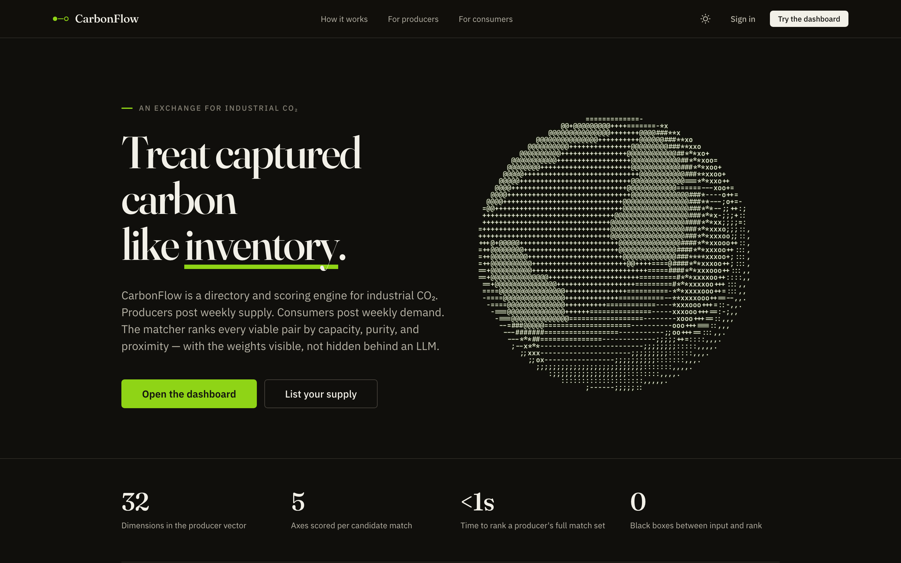

# Hi, I'm Tair

I'm a web developer working mostly in TypeScript, and the founder of [STEM Central Asia](https://stemac.vercel.app), a student-led organization connecting students across six Central Asian countries with STEM opportunities. I like building complex things as simply as possible.

## What I've built

**[CarbonFlow](https://carbonflow.net)** ([repo](https://github.com/MikeZenko/carbonflow)). A marketplace that matches carbon capture technology producers with industrial consumers. React frontend, Flask backend, vector-based match scoring with NumPy and scikit-learn, JWT auth. Deployed and live.

**[Amanuensis](https://github.com/MikeZenko/Amanuensis)**. A local Mac app for drafting prose in your own voice. It builds personas from your writing samples, scores drafts with calibrated stylometry, and refines them through a blind preference loop.

**[STEM Central Asia](https://stemac.vercel.app)** ([repo](https://github.com/MikeZenko/STEMAC)). The organization's website: React, TypeScript, Vite, Tailwind.

**[HBA Foundation scholarship platform](https://github.com/MikeZenko/HBA_Foundation)**. A scholarship database built for a foundation that helps students find educational opportunities abroad. Express and TypeScript backend, Next.js frontend, with an admin workflow for reviewing community submissions.

## Stack

TypeScript, React, Next.js, Node and Express on the web side. Python with Flask and scikit-learn when a project needs ML. I deploy on Vercel and Railway.
